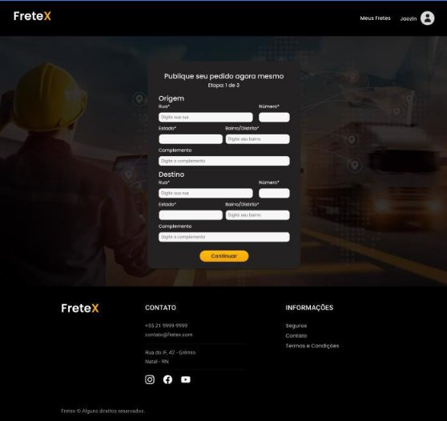
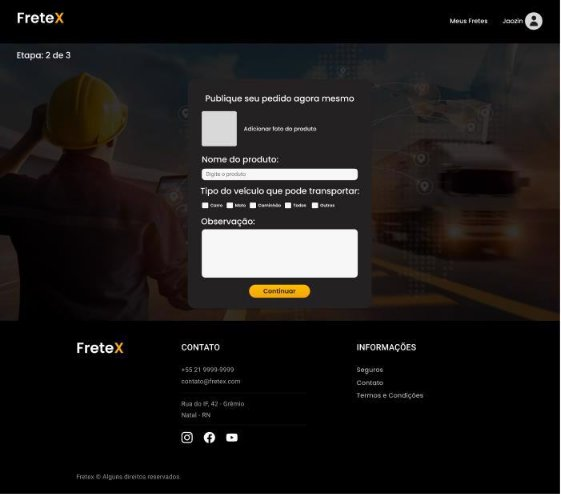
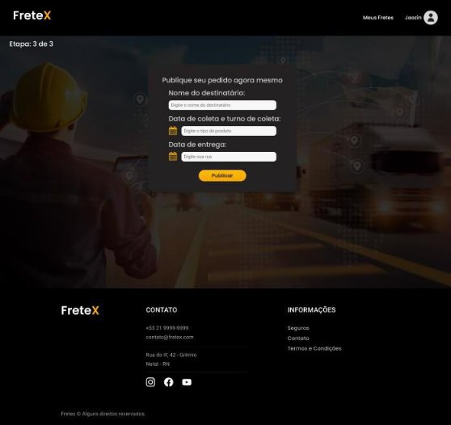
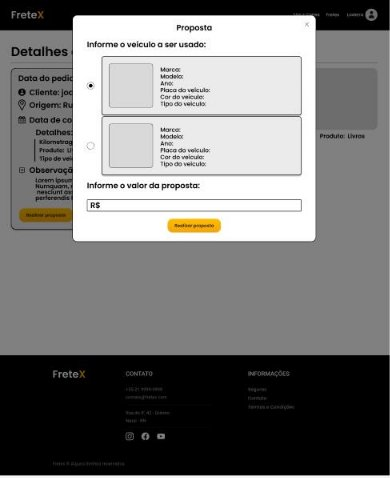
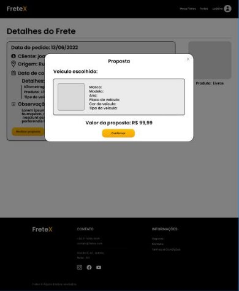
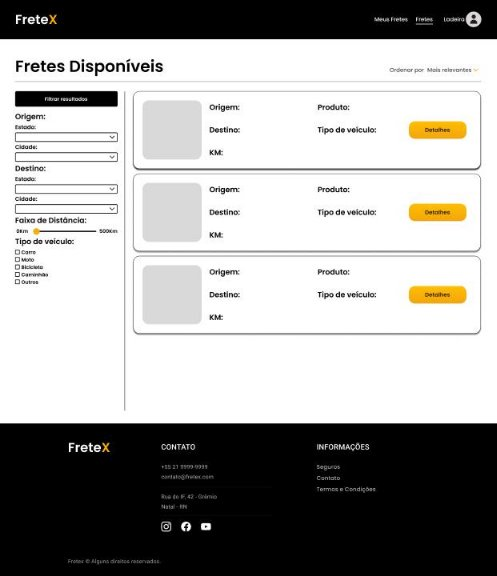

## 
 FRETEX 

**Especificação de Caso de Uso** 

## Listar Meus Fretes. 

## Histórico da Revisão

|**Data** |**Versão** |**Descrição** |**Autor** |
| - | - | - | - |
|08/06/2022 |1.0 |Detalhamento incial. |Italo Gabriel da Silva Monteiro |

## 1- Resumo: 

  - O cliente pode listar um ou mais pedidos de frete. 

## 2- Atores:
  - Cliente 

## 3- Precondições: 

- Estar logado. 

## 4- Fluxos de evento: 
**4.1- Fluxo básico:** 

1. O ator seleciona a opção Meus Fretes no seu Dashboard. 
2. O sistema verifica os pedidos existentes e retorna uma lista com todos  os  pedidos  cadastrados,  seja  em  situação  de  “em  espera”,  ”em andamento” ou “encerrados”. 

**4.2- Fluxo de Exceção – Nenhum pedido cadastrado:** 

  1.  O  sistema  informa  ao  ator  que  ele  não  possui  nenhum  pedido cadastrado. 

## 5- Protótipo(s) de interface do Listar Meus Fretes:

## 
 FRETEX 

**Especificação de Caso de Uso** 

## Cadastrar Pedido de Frete(Cliente).

## Histórico da Revisão

|**Data** |**Versão** |**Descrição** |**Autor** |
| - | - | - | - |
|08/06/2022 |1.0 |Detalhamento incial. |Italo Gabriel da Silva Monteiro |

## 1- Resumo:

- O cliente pode cadastrar um pedido de frete. 

## 2- Atores:
- Cliente 

## 3- Precondições:

- Estar logado. 

## 4- Fluxos de evento: 
**4.1-  Fluxo básico:** 

1. O  ator  seleciona  a  opção  cadastrar  pedido  de  frete  no  seu Dashboard. 
2. O sistema solicita os dados do pedido de frete: Tipo de produto, tipo  de  veículo,  data  de  coleta,  data  de  entrega,  origem,  destino, observação. 
3. O ator preenche todos os dados e confirma o cadastro do pedido. 
4. O sistema verifica se todos os dados foram preenchidos de forma correta. 
5. O sistema cadastra o pedido de frete e coloca-o em situação de “em espera”. 

**4.2- Fluxo de Exceção – Dados inválidos ou incompletos para a abertura do pedido de frete:** 

1. O sistema informará ao ator que o dado em questão foi preenchido de forma incorreta e pede que ele preencha novamente.  
2. O ator preenche de forma correta e solicita novamente a validação do sistema. 
3. O  sistema  valida  novamente  os  dados  e  finaliza  o  cadastro  do pedido de frete. 

## 5- Protótipo(s) de interface do Cadastrar Pedido de Frete:

## 
 FRETEX 

**Especificação de Caso de Uso** 

## Aceitar Proposta(Cliente). 

## Histórico da Revisão

|**Data** |**Versão** |**Descrição** |**Autor** |
| - | - | - | - |
|09/06/2022 |1.0 |Detalhamento inicial. |Mathews Dantas. |

## 1- Resumo: 

- O cliente pode aceitar a proposta feita pelo freteiro. 

## 2- Atores: 
 - Cliente.

## 3- Precondições: 

- Estar logado, existir uma solicitação de frete na situação de “em andamento”, e uma proposta feita pelo freteiro. 

## 4- Fluxos de evento: 
**4.1- Fluxo básico:** 

1. O ator seleciona a opção “ Aceitar”. 
2. O sistema passa o frete para situação “em andamento” . 

## 5- Protótipo(s) de interface do Aceitar Proposta(cliente):

## 
 FRETEX 

**Especificação de Caso de Uso** 

## Realizar proposta(Cliente).

## Histórico da Revisão 

|**Data** |**Versão** |**Descrição** |**Autor** |
| - | - | - | - |
|09/06/2022 |1.0 |Detalhamento inicial. |Mathews Dantas. |

## 1- Resumo: 

 - Caso o cliente não concorde com a proposta recente do frete, ele poderá realizar uma nova proposta ao freteiro. 

## 2- Atores:
 - Cliente. 

## 3- Precondições: 

 - Estar logado e existir um pedido de frete na situação de “em andamento”. 

## 4-Fluxos de evento: 
** 4.1-  Fluxo básico:** 

1. O ator seleciona a opção “ Realizar proposta”. 
2. O sistema solicita o valor da nova proposta para o frete. 
3. O ator informa o novo valor. 
4. O ator finaliza a ação de contraproposta. 
5. O sistema pede uma verificação do valor da proposta. 
6. O ator confirma o valor. 
7. O ator seleciona em submeter proposta. 
8. O sistema confirma a submissão da proposta. 
9. O sistema registra a nova proposta no pedido de frete. 

**4.2 Fluxo de Exceção – Submissão de valor inválido:** 

1. O ator submete uma proposta inválida.  
2. O sistema pede para que o ator cadastre uma proposta válida.  
3. O ator cadastra uma proposta válida.  
4. O ator seleciona a opção submeter proposta. 
5. O sistema pede uma verificação do valor da proposta. 
6. O ator confirma o valor. 
7. O ator finaliza a ação de realizar proposta. 
8. O sistema confirma a submissão da proposta. 
9. O  sistema  cadastra  a  proposta  na  lista  de  ofertas  para  aquele pedido de frete. 

## 5- Protótipo(s) de interface do Realizar Proposta(cliente):

## 
 FRETEX 

**Especificação de Caso de Uso** 

## Aceitar Proposta(Freteiro).

## Histórico da Revisão 

|**Data** |**Versão** |**Descrição** |**Autor** |
| - | - | - | - |
|09/06/2022 |1.0 |Detalhamento inicial. |Mathews Dantas. |

## 1- Resumo:

 - O freteiro pode aceitar a proposta feita pelo cliente. 

## 2- Atores:
- Freteiro.

## 3- Precondições: 

- Estar logado e existir um frete na situação de “em andamento”, que possui uma nova proposta feita pelo cliente. 

## 4- Fluxos de evento: 
**4.1- Fluxo básico:** 

1. O ator seleciona a opção “ Aceitar”. 
2. O sistema passa o frete para situação “em andamento”. 

## 5- Protótipo(s) de interface do Aceitar Proposta(freteiro):  

## 
 FRETEX 

**Especificação de Caso de Uso** 

## Realizar proposta(Freteiro).

## Histórico da Revisão 

|**Data** |**Versão** |**Descrição** |**Autor** |
| - | - | - | - |
|11/06/2022 |1.0 |Detalhamento inicial. |Marcos Alexandre Oliveira |

## 1- Resumo: 

- Permite que o freteiro submeta uma proposta para um pedido de frete. 

## 2- Atores:

- Freteiro. 

## 3- Precondições: 

- Estar logado no sistema e existir um pedido de frete. 

## 4-Fluxos de evento: 
* 4.1-  Fluxo básico:** 

1. O ator seleciona a opção “Realizar proposta”. 
2. O sistema pede para o ator informar o valor da proposta. 
3. O ator informa o valor. 
4. O ator finaliza a ação “Realizar proposta”. 
5. O sistema pede uma verificação do valor da proposta. 
6. O ator confirma o valor. 
7. O ator seleciona a opção submeter proposta. 
8. O sistema confirma a submissão da proposta. 
9. O sistema cadastra a  proposta na lista de propostas para aquele pedido de frete. 

**4.2 Fluxo de Exceção – Submissão de valor inválido:** 

1. O  ator  submete  uma  proposta  inválida(digita  letras  ou  um  valor maior que a proposta anterior).  
2. O sistema pede para que o ator cadastre uma proposta válida.  
3. O ator cadastra uma proposta válida.  
4. O ator seleciona a opção submeter proposta. 
5. O sistema pede uma verificação do valor da proposta. 
6. O ator confirma o valor. 
7. O ator finaliza a ação de realizar proposta. 
8. O sistema confirma a submissão da proposta. 
9. O  sistema  cadastra  a  proposta  na  lista  de  ofertas  para  aquele pedido de frete. 

## 5- Protótipo(s) de interface do Realizar Proposta(freteiro):

## 
 FRETEX 

**Especificação de Caso de Uso** 

## Listar fretes disponíveis 

## Histórico da Revisão 

|**Data** |**Versão** |**Descrição** |**Autor** |
| - | - | - | - |
|12/06/2022 |1.0 |Detalhamento inicial. |Sávio Araújo Carvalho Alves |

## 1- Resumo: 

- Permite listar todos os fretes disponíveis para o freteiro realizar propostas. 

## 2- Atores: 

- Freteiro. 

## 3- Precondições: 

 - Estar logado no sistema. 

## 4-Fluxos de evento: 
**4.1-  Fluxo básico:** 

1. O Freteiro acessa a página dashboard no menu de navegação. 
2. O sistema apresenta todos os fretes disponíveis. 

**5- Protótipo(s) de inteface do Listar Fretes Disponíveis:**  

